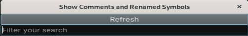

# Comments And Symbols (v1.0.0)
Author: **moval0x1**

_Show comments and symbols renamed during the analysis process._

## Description:

You can use this plugin to show comments and symbols renamed during the analysis process.

When you need to find a comment that you did, you can filter the text to find it and refresh it when you rename a function or add a new comment.

## Installation

Clone this repo into your Binary Ninja plugin directory.

## Minimum Version

This plugin requires the following minimum version of Binary Ninja:

* 4526

## License

This plugin is released under a MIT license.
## Metadata Version

2

## Credits
Inspired by [Comments Viewer](https://github.com/matteyeux/comments-viewer)
