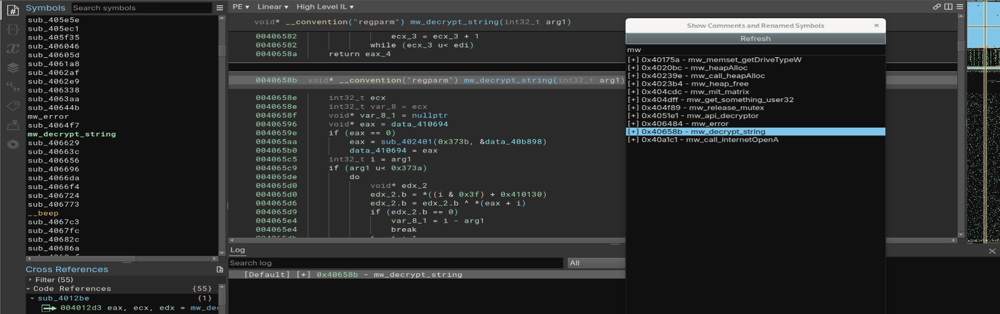

# Comments And Symbols
Author: **moval0x1**

_Comments And Symbols_

## Description:

You can use this plugin to show comments and symbols renamed during the analysis process.

When you need to find a comment that you did, you can filter the text to find it and refresh it when you rename a function or add a new comment.

## Installation

Clone this repo into your Binary Ninja plugin directory.

## Credits
Inspired by [Comments Viewer](https://github.com/matteyeux/comments-viewer)

## Minimum Version

4526

## License

This plugin is released under an [MIT license](./LICENSE).
